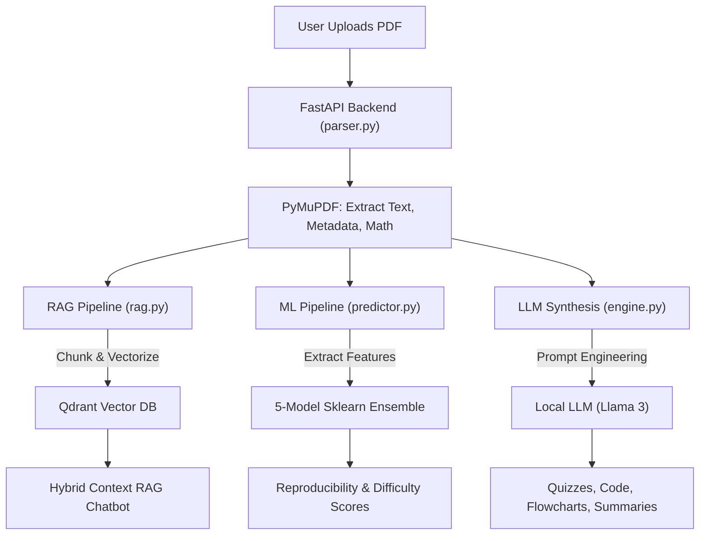

<div align="center">
  
  # 🚀 ResearchLens AI
  **An Intelligent AI-Powered Research Mentor**
  
  [](https://python.org)
  [](https://fastapi.tiangolo.com/)
  [](https://streamlit.io/)
  [](https://langchain.com/)
  [](https://qdrant.tech/)

  *ResearchLens AI is a state-of-the-art GenAI platform designed to help students, developers, and scientists instantly understand, dissect, and interrogate complex research papers. It combines deep NLP text parsing with machine learning to provide intelligent, human-readable insights.*

</div>

---

## 🎯 The Problem & The Solution

| ❌ The Problem | 💡 The ResearchLens Solution |
| :--- | :--- |
| **Information Overload**: Research papers are dense, filled with complex jargon, and difficult to skim quickly. | **Instant Summarization**: Extracts the core methodology, key findings, and translates them into beginner, intermediate, and advanced summaries. |
| **Math Intimidation**: Heavy mathematical formulas often block developers from understanding the core algorithms. | **Math Explainer**: Automatically isolates LaTeX/math equations and translates them into plain English explanations. |
| **Implementation Uncertainty**: It's hard to know if a paper is actually reproducible before investing weeks of coding. | **5-Model ML Ensemble**: Uses Random Forest, Gradient Boosting, Ridge, SVM, and KNN to predict the *Implementation Difficulty* and *Reproducibility Score*. |
| **Missing Architecture Views**: Mentally mapping a paper's pipeline takes significant cognitive effort. | **Auto-Mermaid Diagramming**: Synthesizes the text into a visual, rendered flowchart of the paper's architecture. |

---

## 💻 Comprehensive Tech Stack

| Layer | Technologies Used | Purpose |
| :--- | :--- | :--- |
| **🎨 Frontend** | `Streamlit`, Custom CSS | Builds the glassmorphism UI, interactive grids, and responsive user interfaces. |
| **⚙️ Backend Core** | `FastAPI`, `Uvicorn`, `Pydantic` | Lightning-fast asynchronous REST API architecture and data validation. |
| **🗄️ Data & Parsing**| `PyMuPDF (fitz)` | Extracts raw text, metadata, equations, and references from heavy PDFs. |
| **🧠 AI Orchestration**| `LangChain` | Chains LLM prompts to our RAG pipeline, generating structured AI responses. |
| **📊 Vector Database** | `Qdrant` (In-Memory) | Ultra-fast similarity search and vector storage for the chatbot. |
| **🧬 Embeddings** | `HuggingFace (BAAI/bge-base-en-v1.5)` | Converts text chunks into high-dimensional vectors for semantic search. |
| **🤖 Machine Learning**| `Scikit-Learn` | Powers the 5-model ensemble (Random Forest, Gradient Boosting, SVM, Ridge, KNN). |
| **🗣️ Inference Engine**| `OpenRouter API` | Cloud-based inference engine providing access to `Llama-3.1-8b-instruct`. |

---

## 📂 Project Structure

```text
Research Paper Lens System/
│
├── backend/                  # FastAPI Backend Server (Auto-managed by Frontend)
│   ├── core/
│   │   ├── engine.py         # LLM Prompt Synthesis & Generators (Quizzes, Code, Diagrams)
│   │   ├── parser.py         # PyMuPDF Document Ingestion & Metadata Extraction
│   │   ├── predictor.py      # Scikit-Learn 5-Model Ensemble (Difficulty & Reproducibility)
│   │   └── rag.py            # LangChain & Qdrant Vector Retrieval System
│   ├── models/               # Pydantic Schemas
│   ├── config.py             # Environment Variables & Settings
│   └── main.py               # FastAPI Routes & App Initialization
│
├── frontend/                 # Streamlit Frontend Client (Launches Backend Automatically)
│   ├── assets/
│   │   └── styles.css        # Premium Glassmorphism & UI Animations
│   └── app.py                # Main Application Layout & Dashboard
│
├── data/                     # Local Storage (if configured)
├── requirements.txt          # Python Dependencies
├── .env                      # API Keys and LLM Endpoints
└── README.md                 # Project Documentation
```

---

## 🏗️ System Architecture

The platform operates on a decoupled, modular pipeline for maximum speed and security:



### 1. Ingestion & Parsing
PDFs are uploaded entirely into memory without touching the disk for security and speed. `PyMuPDF` parses the document, extracting raw text, identifying structural sections, detecting mathematical equations, and gathering metadata.

### 2. RAG Pipeline
The raw text is chunked using LangChain's `RecursiveCharacterTextSplitter`. Chunks are vectorized and stored in an in-memory `Qdrant` vector database. 
**Hybrid Context Injection:** To prevent semantic search from failing on generic queries (e.g., "summarize this paper"), the backend automatically injects the paper's title and abstract directly into the LLM's context alongside the retrieved vector chunks.

### 3. Machine Learning Ensemble
A proprietary feature-extraction engine analyzes the paper's structural traits. These features are fed into a pre-trained 5-model Scikit-Learn ensemble that votes to output a final *Reproducibility Score* (1-10) and an *Implementation Difficulty* along with confidence metrics.

### 4. LLM Synthesis Engine
Specialized prompt-chains command the connected LLM to execute distinct tasks: generating Python starter code, crafting JSON interactive quizzes, mapping knowledge gaps, and writing Mermaid.js architecture graphs. A custom Python regex-sanitizer intercepts LLM diagram outputs to strictly adhere to Mermaid v11 syntax, preventing frontend render crashes.

---

## 🚀 Step-by-Step Implementation

### Step 1: Prerequisites
Ensure you have the following installed on your system:
- **Python 3.9+**
- **Git**
- An **[OpenRouter](https://openrouter.ai/)** account with a valid API key.
- A **[Qdrant](https://qdrant.tech/)** Cloud cluster URL and API key.

### Step 2: Clone & Setup Virtual Environment
```bash
# Clone the repository
git clone https://github.com/Krush2004/Research-Paper-Lens-AI.git
cd Research-Paper-Lens-AI

# Create a virtual environment
python -m venv env

# Activate it (Windows)
env\Scripts\activate
# Activate it (Mac/Linux)
source env/bin/activate
```

### Step 3: Install Dependencies
```bash
pip install -r requirements.txt
```

### Step 4: Environment Configuration
Create a `.env` file in the root directory and define your API keys. The system is configured to use OpenRouter for access to premium LLMs (like Llama 3.1) and Qdrant for vector storage:
```env
# OpenRouter API Key for LLM access
OPENROUTER_API_KEY=your_openrouter_api_key_here

# Qdrant Vector Database config
QDRANT_URL=your_qdrant_cluster_url
QDRANT_API_KEY=your_qdrant_api_key
```
*Note: The system automatically defaults to `meta-llama/llama-3.1-8b-instruct` and `BAAI/bge-base-en-v1.5` for embeddings in `backend/config.py`.*

### Step 5: Launch the Platform
The system features an **Integrated Lifecycle Manager**. You only need to run the Streamlit frontend; it will automatically detect if the FastAPI backend is running and launch it in the background if necessary.

```bash
# Ensure your virtual environment is active!
streamlit run frontend/app.py
```

**What happens behind the scenes?**
1.  **Port Check**: The system checks if port `8000` is active.
2.  **Auto-Boot**: If not, it spawns the FastAPI backend as a background process.
3.  **Health Check**: The UI displays an initialization status while waiting for the AI engines to fully load.
4.  **Ready**: Once the backend responds, the full research dashboard is unlocked.

---

## 👨‍💻 Credits & Author

**Designed and Engineered by [Krushna / Krush]**

This project is a culmination of advanced prompt engineering, custom RAG architectures, and responsive web design. It represents a major leap in using Generative AI to make complex academic research highly accessible and interactive. 

*If you found this platform useful, feel free to star the repository and reach out!*

<div align="center">
  <i>Built for the future of academic research.</i><br>
  <b>Contributions and feature requests are welcome!</b>
</div>
